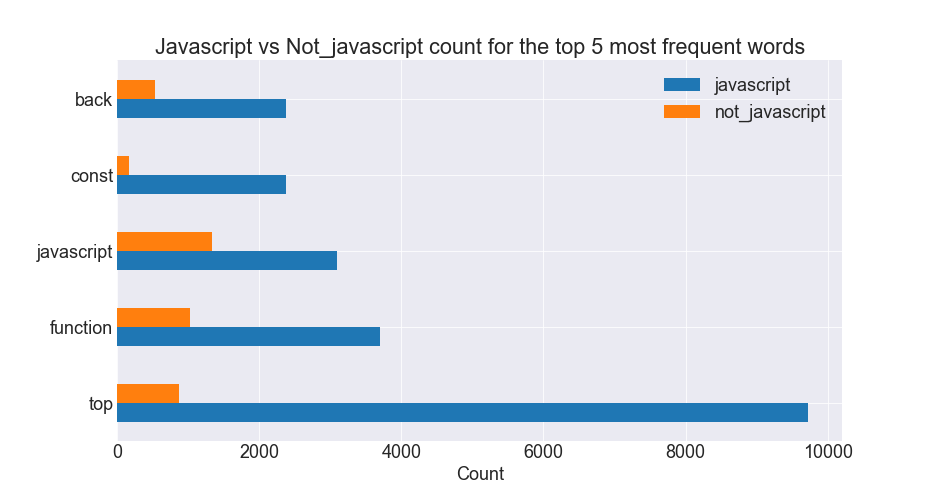
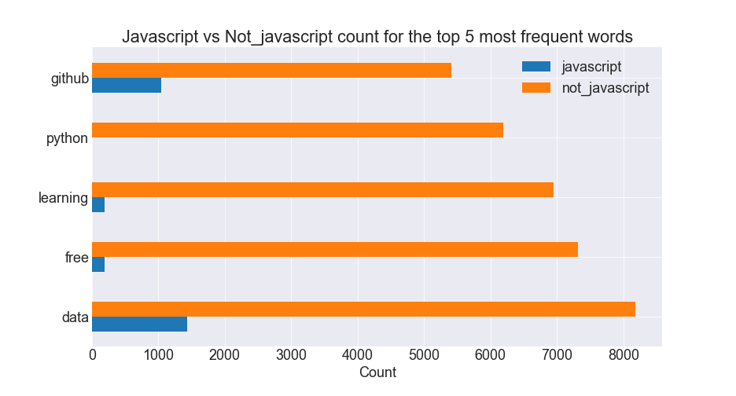
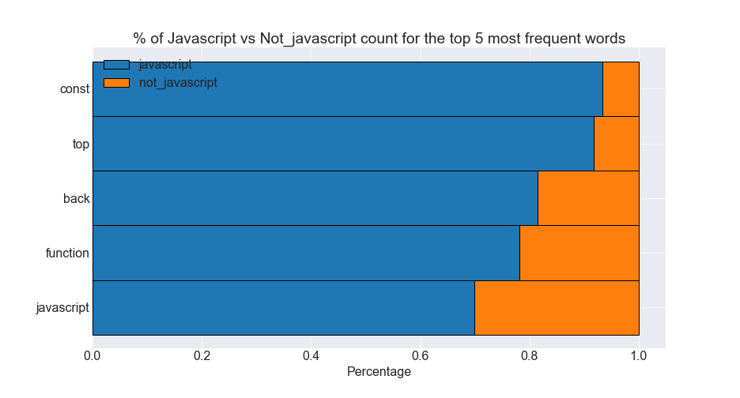
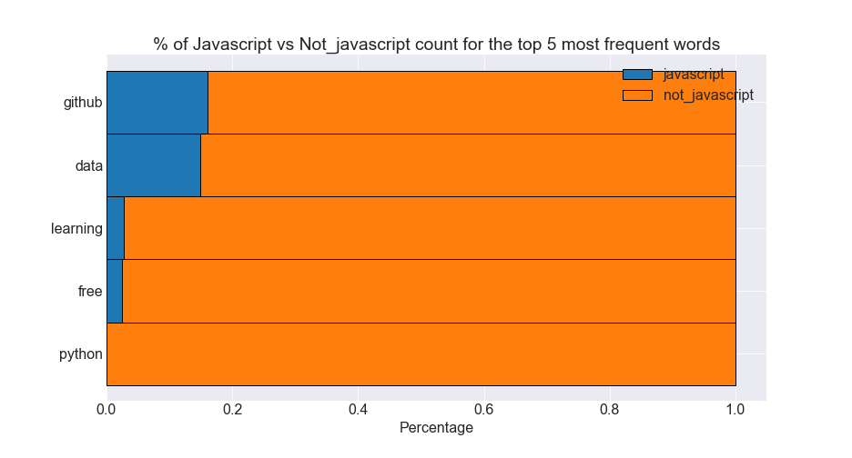
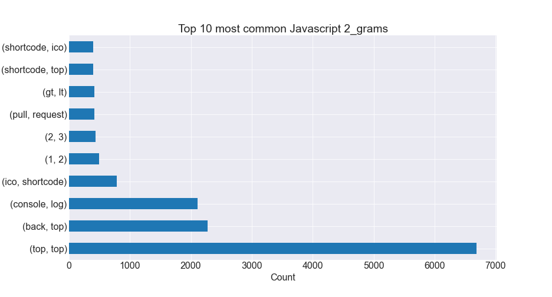
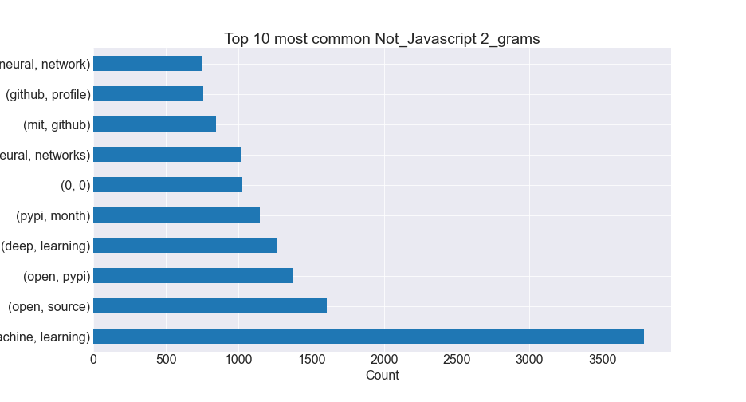
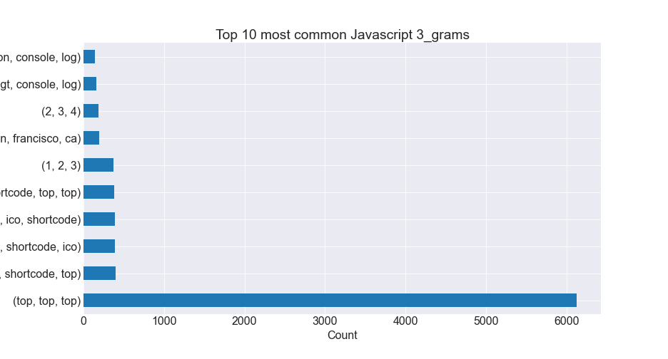
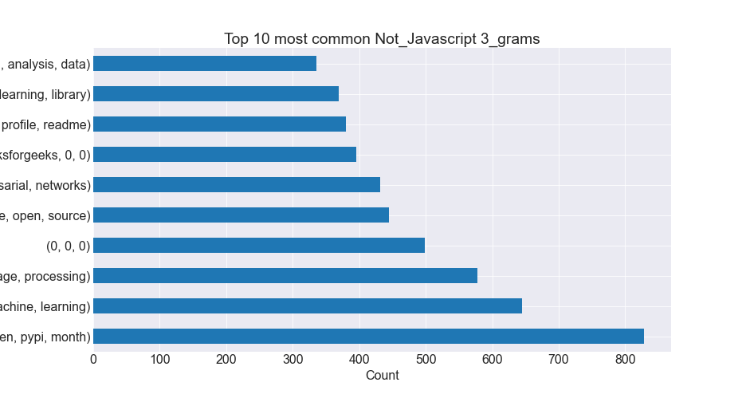
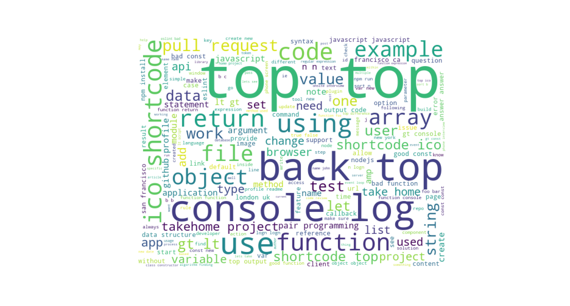
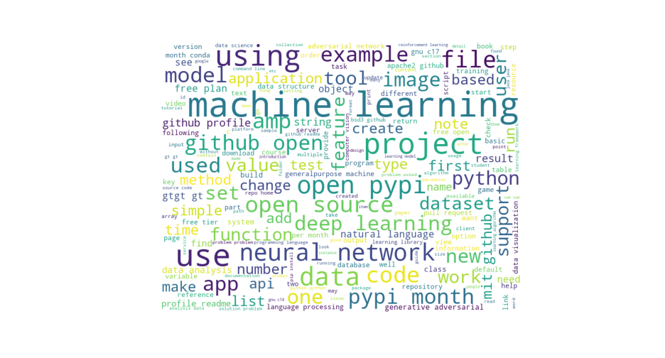

<h1>Natural Language Processing - Github Programming Language Prediction

# Table of Contents 
1. [Project Planning](#project_planning)
    1. [Project Objectives](#project_objectives)
    2. [Business Goals](#business_goals)
    3. [Audience](#audience)
    4. [Deliverables](#deliverables)
2. [Executive Summary](#exe_sum)
    1. [Goals](#goals)
    2. [Findings](#findings)
3. [Acquire Data](#acquire)
    1. [Data Dictonary](#data_dict)
    2. [Acquire Takeaways](#acquire_takeaways)
4. [Prepare Data](#prep_data)
    1. [Distributions](#distributions)
    2. [Prepare Takeaways](#prepare_takeaways)
5. [Data Exploration](#explore)
    1. [Explore Takeaways](#explore_takeaways)
    2. [Hypothesis](#hypothesis)
6. [Modeling & Evaluation](#modeling)
    1. [Modeling Takeaways](#model_takeaways)
6. [Project Delivery](#delivery)
    1. [Conclusions & Next Steps](#conclusions_next_steps)
    2. [Project Replication](#replication)

## Project Planning
✓ 🟢 **Plan** ➜ ☐ _Acquire_ ➜ ☐ _Prepare_ ➜ ☐ _Explore_ ➜ ☐ _Model_ ➜ ☐ _Deliver_

### Project Objectives 
> - For this project our team is to build a model that can predict what programming language a repository will be, given the text of a README file.
> - In addition to this, we are to build a well-documented jupyter notebook that contains the analysis of this prediction.
> - Any abstracted modules that are created to make the presentation more clean, during the acquistion and preparation of data.
> - Finally, we are to build a few Google slides to present toward a general audience that summarizes the findings within the project, with many visualizations.

### Business Goals 
> - Build a script that will find, then scrape the README files from Github.
> - Prepare, explore and clean the data so that it can be input into modeling.
> - Utilizie Term Frequence (TF) Inverse Document Frequency (IDF) and a combination of the two features to assist with the modeling.
> - Document all these steps thoroughly.

### Audience 
> - General population and individuals without specific knowledge or understanding of the topic or subject.

### Deliverables
> - A clearly named final notebook. This notebook will contain more detailed processes other than noted within the README and have abstracted scripts to assist on readability.
> - A README that explains what the project is, how to reproduce the project, and notes about the project.
> - A Python module or modules that automate the data acquisition and preparation process. These modules should be imported and used in your final notebook.

<a href='#toc'>Table of Contents</a>

## Executive Summary
> - 30,000 repository README files were scraped from Github.
> - Javascript files were analyzed and compared against all other README files.
> - Our model performed well, identifying Javascript repositories with an accuracy of over 94.8%.

### Goals
> - Build a model that can predict what programming language a repository will be, given the text of a README file.

### Findings
> - The average message length of Javascript readme files is significantly different than the average message length of all other readme files.
> - The average compound sentiment analysis score for Javascript readme files is significantly different than the average compound sentiment analysis score for all other readme files.
> - The average avg_word_len for Javascript readme files is significantly different than the average avg_word_len of all other readme files.
> - The average word_count for Javascript readme files is significantly different than the average word_count of all other readme files.
> - The best preforming model, a Multinomial Naive Bayes classifier, achieved an out-of-sample test accuracy of 94.8%

<a href='#toc'>Table of Contents</a>

## Acquire Data
✓ _Plan_ ➜ 🟢 **Acquire** ➜ ☐ _Prepare_ ➜ ☐ _Explore_ ➜ ☐ _Model_ ➜ ☐ _Deliver_
> - Our first issue was locating a sufficient number of README destinations to actually parse. The solution we devised was to look at a person's followers on Github, then add those followers to a list.
We would also parse up to the first 30 repository destinations from that user. Then we would iterate to the next follower and continue until we had around 30,000 repository destinations.
> - Once we had our destinations, we scraped the README text and all the programming languages and their associated percentages.
> - To determine the primary programming language of any repository, we first read in the percentages of the programming languages used in it and set a percentage threshold. So, if a programming language was at or above that threshold, it was considered the primary programming language of the repository.

### DataFrame Dict

| Feature           | Datatype                         | Definition                                                 |
|:------------------|:---------------------------------|:-----------------------------------------------------------|
| prog_lang         | 5728 non-null: object           | The predominant programming language used in the repository|
| original          | 5728 non-null: object           | Original readme content of the scraped repository          |
| cleaned           | 5728 non-null: object           | The cleaned version of the readme                          |
| label             | 5728 non-null: object           | The programming language label; the target variable
| stemmed           | 5728 non-null: object           | The cleaned, stemmed version of the readme                 |
| lemmatized        | 5728 non-null: object           | The cleaned, lemmatized version of the readme              |

### Takeaways from Acquire:
> - Target Variable: label
> - This dataframe currently has 5,728 rows and 6 columns.
> - There are 0 missing values.
> - All columns are string object types.

<a href='#toc'>Table of Contents</a>

## Prepare Data
✓ _Plan_ ➜ ✓ _Acquire_ ➜ 🟢 **Prepare** ➜ ☐ _Explore_ ➜ ☐ _Model_ ➜ ☐ _Deliver_

> - Converted all characters to lowercase, 
> - Normalized unicode characters, 
> - Encoded into ascii byte strings and ignored unknown characters,
> - Decoded into usable UTF-8 strings,
> - Removed anything that was not either a letter, number, or whitespace,
> - tokenized the data.
> - To make our model more accurate, we decided to filter out words that that didn't seem to be important for identification purposes. To do this, we found the counts of each word used in the repositories for a particular programming language. Then, we removed any words that had a Z-score of .5 or below. This removed any junk words that may have been present and placed greater emphasis on the words that were most prevalent.
> - We performed this process twice. Once for the designated programming language, and then again for all of the repositories that were NOT that language.
> - Then we created both stemmed and lemmatized versions of the cleaned data.
> - Finally, we split the data into train and test sets.

### Prepare Takeaways

> - The data was cleaned and is ready for exploration on the train data set.
                     

<a href='#toc'>Table of Contents</a>

## Explore Data
✓ _Plan_ ➜ ✓ _Acquire_ ➜ ✓ _Prepare_ ➜ 🟢 **Explore** ➜ ☐ _Model_ ➜ ☐ _Deliver_

> - Utilizing a class, we explored the data and tested several hypotheses.
> - We compared word, bigram, and trigram counts and created visualizations for each.
> - We created visualizations for the distributions of the compound sentiment analysis score.
> - We created word clouds for quick visualization of the most common words.

### Horizontal Barplots

|
Javascript
|
Non-Javascript
|
|:-:|:-:|
|||

### Stacked Horizontal Barplots

|
Javascript
|
Non-Javascript
|
|:-:|:-:|
|||

### Bigram Plots

|
Javascript
|
Non-Javascript
|
|:-:|:-:|
|||

### Trigram Plots

|
Javascript
|
Non-Javascript
|
|:-:|:-:|
|||

### Wordcloud Plots

|
Javascript
|
Non-Javascript
|
|:-:|:-:|
|||

### Explore Takeaways

> - The top 5 most common words in Javascript readme files occur in Javascript files much more frequently than all other readme files.
> - Javascript sentiment analysis compound scores tend to be more positive than all Non-Javascript, while all Non-Javascript tend to be more neutral than Javascript.

<a href='#toc'>Table of Contents</a>

### Hypothesis Testing

#### Hypothesis 1
> - H0: The average message length of Javascript readme files == The average message length of all other readme files.
> - Ha: The average message length of Javascript readme files != The average message length of all other readme files.
> - alpha: 0.05
> - Since the p-value is less than 0.05, we reject the null hypothesis. The average message length of Javascript readme files is significantly different than the average message length of all other readme files.

#### Hypothesis 2
> - H0: The average compound sentiment analysis of Javascript readme files == The average compound sentiment analysis of all other readme files.
> - Ha: The average compound sentiment analysis of Javascript readme files != The average compound sentiment analysis of all other readme files.
> - alpha = 0.05
> - Since the p-value is less than alpha, we reject the null hypothesis. The average compound sentiment analysis score for Javascript readme files is significantly different than the average compound sentiment analysis score for all other readme files.

#### Hypothesis 3
> - H0: The average avg_word_len of Javascript readme files == The average avg_word_len of all other readme files.
> - Ha: The average avg_word_len of Javascript readme files != The average avg_word_len of all other readme files.
> - alpha = 0.05
> - Since the p-value is less than 0.05, we reject the null hypothesis. The average avg_word_len for Javascript readme files is significantly different than the average avg_word_len of all other readme files.

#### Hypothesis 4
> - H0: The average word_count of Javascript readme files == The average word_count of all other readme files.
> - Ha: The average word_count of Javascript readme files != The average word_count of all other readme files.
> - alpha = 0.05
> - Since the p-value is less than 0.05, we reject the null hypothesis. The average word_count for Javascript readme files is significantly different than the average word_count of all other readme files.

## Modeling & Evaluation
✓ _Plan_ ➜ ✓ _Acquire_ ➜ ✓ _Prepare_ ➜ ✓ _Explore_ ➜ 🟢 **Model** ➜ ☐ _Deliver_

> - Created a class to vectorize and create, fit, and evaluate models on in and out-of-sample datasets.
> - Utilized a class method using cross-validate to fit and evaluate models on a specified number of K-Folded splits, garnering an average validate accuracy score for each classifier type.
> - Chose the best model from cross-validation and evaluated the accuracy on out-of-sample test data.

#### K-Fold and Cross-validation References:
> - For more information on the workings of cross-validation, visit https://scikit-learn.org/stable/modules/cross_validation.html
> - For information on how cross-validation works in conjunction with K-Folding visit https://scikit-learn.org/stable/modules/cross_validation.html#k-fold

### Modeling Takeaways

> - Got best performance from classifiers with K-Folds set to 10.
> - The best performing classifier types were Multinomial Naive Bayes classifiers with alpha = 0.5, averaging 94.13% across all cross-validate splits.
> - Best single model accuracy score on a cross-validation test (validate) subset from was 95.42%
> - Using that model, achieved an out-of-sample test accuracy score of 94.8%.

<a href='#toc'>Table of Contents</a>

## Project Delivery
✓ _Plan_ ➜ ✓ _Acquire_ ➜ ✓ _Prepare_ ➜ ✓ _Explore_ ➜ ✓ _Model_ ➜ 🟢 **Deliver**

### Conclusion and Next Steps
> - Javascript repository `README` files have consistent, identifying characteristics such as average word length, message length, and word count.
> - With more time, we would like to build a multi-class classification model and do more feature engineering.

### Project Replication
> - Download the `acquire.py`, `prepare.py`, `explore.py`, and `model.py` modules to your working directory.
> - Download the all files from dataset which can be found at <a href='https://www.kaggle.com/shankanater/data-to-recreate-nlp-project/download'>Kaggle</a>
> - Run the `final_report.ipynb` Juypter Notebook.

<a href='#toc'>Table of Contents</a>

